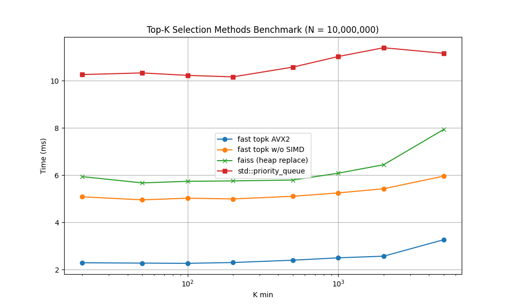

# Fast Top-K

**A lightweight, header-only C++20 library for highly optimized numeric top-k selection, well-suited for vector database applications.**

## Overview

This fast top-k library adopts codes from Google Research's [ScaNN (Scalable Nearest Neighbors)](https://github.com/google-research/google-research/tree/master/scann) project.

It is refactored as a lean, **header-only library with no external dependencies beyond the standard library.**  Makes it easy to integrate into various projects without the complexity of managing additional dependencies like Bazel, Abseil or TensorFlow, which ScaNN might utilize.

## Getting Started
Check [test](tests/test.cpp) or [benchmark](tests/bench.cpp) as examples.

## Performance

* CPU: Intel Core i9-9880H @ 2.30GHz
* Compiler: Apple clang version 16.0.0
* Sources: [fast topk](tests/bench.cpp) and [faiss](https://github.com/facebookresearch/faiss/blob/main/benchs/bench_heap_replace.cpp)

## Acknowledgements
This library benefits from the excellent work done by the Google Research's [ScaNN (Scalable Nearest Neighbors)](https://github.com/google-research/google-research/tree/master/scann) project.
